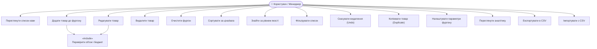
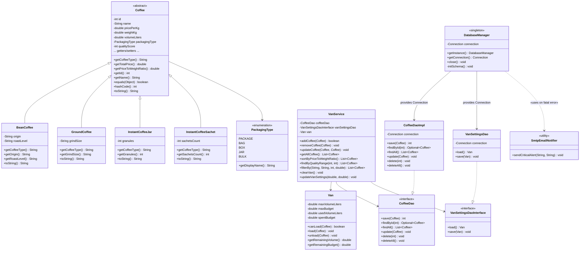
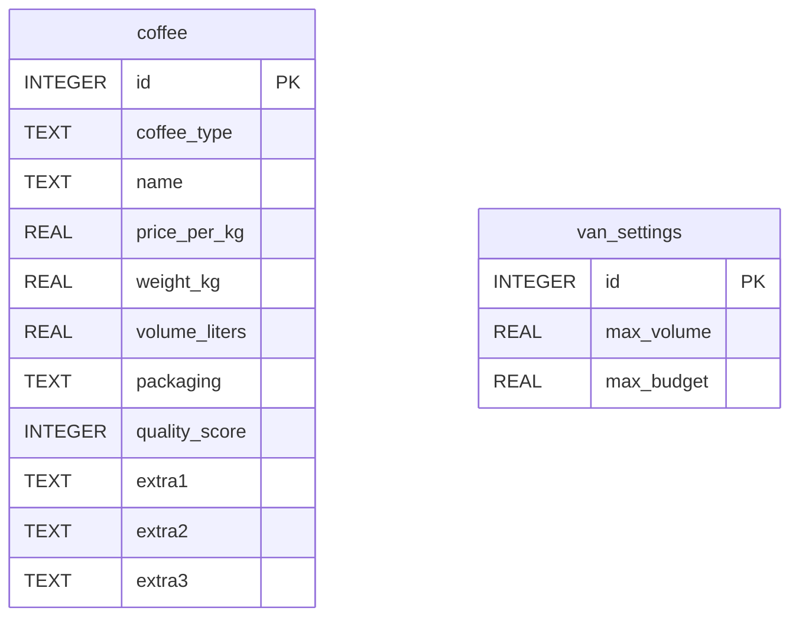

# UML Діаграми — Coffee Van

## 1. Use Case Diagram (Діаграма варіантів використання)



---

## 2. Class Diagram (Діаграма класів)



---

## 3. Database Schema (Схема бази даних)



**Правила зберігання полів `extra1..3` для кожного підтипу кави:**

| Тип (`coffee_type`) | extra1 | extra2 | extra3 |
| :--- | :--- | :--- | :--- |
| `Зернова` | Походження (origin) | Рівень обсмаження (roastLevel) | NULL |
| `Мелена` | Розмір помолу (grindSize) | NULL | NULL |
| `Розчинна (банка)` | Кількість гранул (granules) | NULL | NULL |
| `Розчинна (пакетик)` | Кількість пакетиків (sachetsCount) | NULL | NULL |

---

## 4. Package Structure (Структура пакетів)

```
ua.lpnu.coffevan
├── App.java                     ← Точка входу (JavaFX Application)
├── model/
│   ├── Coffee.java              ← Абстрактний базовий клас
│   ├── BeanCoffee.java          ← Зернова кава
│   ├── GroundCoffee.java        ← Мелена кава
│   ├── InstantCoffeeJar.java    ← Розчинна (банка)
│   ├── InstantCoffeeSachet.java ← Розчинна (пакетик)
│   ├── Van.java                 ← Модель фургону
│   └── PackagingType.java       ← Enum типів упаковки
├── dao/
│   ├── CoffeeDao.java           ← Інтерфейс DAO для кави
│   ├── CoffeeDaoImpl.java       ← SQLite реалізація
│   ├── VanSettingsDaoInterface.java  ← Інтерфейс DAO налаштувань
│   ├── VanSettingsDao.java      ← SQLite реалізація налаштувань
│   └── DatabaseManager.java     ← Singleton-менеджер з'єднань
├── service/
│   └── VanService.java          ← Бізнес-логіка
├── ui/
│   ├── MainWindow.java          ← Головне вікно JavaFX
│   ├── CoffeeDialog.java        ← Діалог додавання/редагування
│   ├── SearchDialog.java        ← Діалог пошуку за якістю
│   ├── VanSettingsDialog.java   ← Діалог налаштувань фургону
│   └── AnalyticsDialog.java     ← Вікно аналітики
└── util/
    └── SmtpEmailNotifier.java   ← Email-нотифікатор про критичні помилки
```
